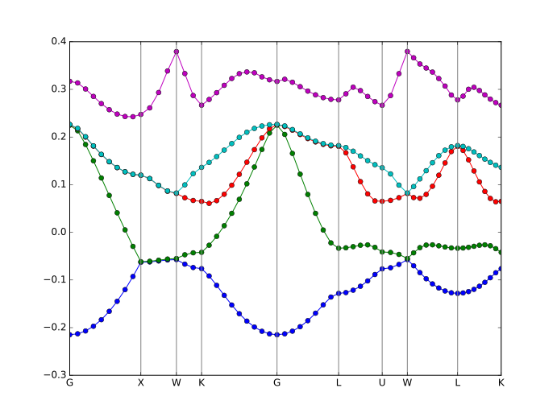

# PWDFT.jl

`PWDFT.jl` is a package to solve
[electronic structure problems](https://en.wikipedia.org/wiki/Electronic_structure)
based on
[density functional theory](https://en.wikipedia.org/wiki/Density_functional_theory)
(DFT)
and [Kohn-Sham equations](https://en.wikipedia.org/wiki/Kohn%E2%80%93Sham_equations).
It is written in [Julia programming language](https://julialang.org).

The Kohn-Sham orbitals are expanded using plane wave basis. This basis set is
very popular within solid-state community and is also used in several electronic
structure package such as Quantum ESPRESSO, ABINIT, VASP, etc.

## Features

- Total energy calculation of molecules, surfaces, and crystalline system
  within periodic unit cell (however, no corrections are 
  implemented for non-periodic systems yet).
- SCF with electron density mixing (for semiconducting and metallic systems)
- Direct minimization method using conjugate gradient (for semiconducting systems)
- GTH pseudopotentials (included in the repository)
- LDA-VWN and GGA-PBE functionals (via `Libxc.jl`)

## Requirements

- [Julia](https://julialang.org/downloads) version >= 0.7,
  with the following packages installed:
  - `FFTW`
  - `SpecialFunctions`
  - `Libxc` (a wrapper to [Libxc](https://gitlab.com/libxc/libxc))
  - `LibSymspg` (a wrapper to [symspg](https://github.com/atztogo/spglib))

These packages are registered so they can be installed by using Julia's package manager.

```julia
using Pkg
Pkg.add("FFTW")
Pkg.add("SpecialFunctions")
Pkg.add("Libxc")
Pkg.add("LibSymspg")
```

These packages should be automatically installed `PWDFT.jl` is installed as
local package (see below).

Many thanks to @unkcpz for providing `Libxc` and `LibSymspg`.

## Installation

Currently, this package is not yet registered. So, `Pkg.add("PWDFT")` will not work (yet).

We have several alternatives:

1. Using Julia's package manager to install directly from the repository URL:

```julia
Pkg.add(PackageSpec(url="https://github.com/f-fathurrahman/PWDFT.jl"))
```

2. Using Julia development directory. We will use `$HOME/.julia/dev` for this.
   To enable `$HOME/.julia/dev` directory, we need to modify the Julia's
  `LOAD_PATH` variable. Add the following line in your
  `$HOME/.julia/config/startup.jl`.

```julia
push!(LOAD_PATH, expanduser("~/.julia/dev"))
```

  After this has been set, you can download the the package as zip file (using Github) or
  clone this repository to your computer.

  If you download the zip file, extract the zip file under
  `$HOME/.julia/dev`. You need to rename the extracted directory
  to `PWDFT` (with no `.jl` extension).

  Alternatively, create symlink under `$HOME/.julia/dev`
  to point to you cloned (or extracted) `PWDFT.jl` directory. The link name should not
  contain the `.jl` part. For example:

```bash
ln -fs /path/to/PWDFT.jl $HOME/.julia/dev/PWDFT
```

3. Install PWDFT.jl as local package. Firstly, get into Pkg's REPL mode by tapping `]`,
and activate a independent environment `activate .` .

Install the PWDFT.jl package in this environment:

```sh
(PWDFT) pkg> develop <path/to/PWDFT.jl>
```

To make sure that the package is installed correctly, you can load the package
and verify that there are no error messages during precompilation step.
You can do this by typing the following in the Julia console.

```julia
using PWDFT
```


Change directory to `examples/Si_fcc` and run the following in the terminal.

```
julia run.jl
```

The above command will calculate total energy of hydrogen atom by SCF method.


The script will calculate total energy per unit cell of silicon crystal using
self-consistent field iteration and direct energy minimization.


## Units

`PWDFT.jl` internally uses Hartree atomic units (energy in Hartree and length in bohr).

## A simple work flow

- create an instance of `Atoms`:

```julia
atoms = Atoms(xyz_file="CH4.xyz", LatVecs=gen_lattice_sc(16.0))
```

- create an instance of `Hamiltonian`:

```julia
ecutwfc = 15.0 # in Hartree
pspfiles = ["../pseudopotentials/pade_gth/C-q4.gth",
            "../pseudopotentials/pade_gth/H-q1.gth"]
Ham = Hamiltonian( atoms, pspfiles, ecutwfc )
```

- solve the Kohn-Sham problem

```julia
KS_solve_SCF!( Ham, betamix=0.2 )  # using SCF (self-consistent field) method
# or
KS_solve_Emin_PCG!( Ham ) # direct minimization using preconditioned conjugate gradient
```

## More examples on creating an instance of `Atoms`

GaAs crystal (primitive unit cell), using keyword `xyz_string_frac`:
```julia
# Atoms
atoms = Atoms( xyz_string_frac=
    """
    2

    Ga  0.0   0.0   0.0
    As  0.25  0.25  0.25
    """,
    in_bohr=true,
    LatVecs = gen_lattice_fcc(10.6839444516)
)
```


Hydrazine molecule in extended xyz file
```julia
atoms = Atoms(ext_xyz_file="N2H4.xyz")
```
with the following `N2H4.xyz` file:
```
6
Lattice="11.896428 0.0 0.0 0.0 12.185504 0.0 0.0 0.0 11.151965" Properties=species:S:1:pos:R:3:Z:I:1 pbc="T T T"
N       5.94821400       6.81171100       5.22639100        7 
N       5.94821400       5.37379300       5.22639100        7 
H       6.15929600       7.18550400       6.15196500        1 
H       5.00000000       7.09777800       5.00000000        1 
H       5.73713200       5.00000000       6.15196500        1 
H       6.89642800       5.08772600       5.00000000        1 
```
Lattice vectors information is taken from the xyz file.


## More examples on creating an instance of `Hamiltonian`

Using 3x3x3 Monkhorst-Pack kpoint grid (usually used for crystalline systems):
```julia
Ham = Hamiltonian( atoms, pspfiles, ecutwfc, meshk=[3,3,3] )
```

Include 4 extra states:
```julia
Ham = Hamiltonian( atoms, pspfiles, ecutwfc, meshk=[3,3,3], extra_states=4 )
```

Using spin-polarized (`Nspin=2 `):
```julia
Ham = Hamiltonian( atoms, pspfiles, ecutwfc, meshk=[3,3,3],
    Nspin=2, extra_states=4 )
```

NOTES: Currently spin-polarized calculations are only supported by
specifying calculations with smearing scheme (no fixed magnetization), so `extra_states`
is usually should also be specified.


Using PBE exchange-correlation functional:
```julia
Ham = Hamiltonian( atoms, pspfiles, ecutwfc, meshk=[3,3,3],
    Nspin=2, extra_states=4, xcfunc="PBE" )
```
Currently, only two XC functional is supported, namely `xcfunc="VWN"` (default) and
`xcfunc="PBE"`. Future developments should support all functionals included in LibXC.


## More examples on solving the Kohn-Sham problem

Several solvers are available:

- `KS_solve_SCF!`: SCF algorithm with density mixing

- `KS_solve_SCF_potmix!`: SCF algorithm with XC and Hartree potential mixing

- `KS_solve_Emin_PCG!`: using direct total energy minimization by preconditioned conjugate
  gradient method (proposed by Prof. Arias, et al.). Only
  the version which works with systems with band gap is implemented.

Stopping criteria is based on difference in total energy.


The following example will use `Emin_PCG`.
It will stop if the difference in total energy is less than
`etot_conv_thr` and it occurs twice in a row.
```julia
KS_solve_Emin_PCG!( Ham, etot_conv_thr=1e-6, NiterMax=150 )
```

Using SCF with `betamix` (mixing parameter) 0.1:
```julia
KS_solve_SCF!( Ham, betamix=0.1 )
```
Smaller `betamix` usually will lead to slower convergence but more stable.
Larger `betamix` will give faster convergence but might result in unstable
SCF.

Several mixing methods are available in `KS_solve_SCF!`:

- `simple` or linear mixing

- `linear_adaptive`

- `anderson`

- `broyden`

- `pulay`

- `ppulay` (periodic Pulay mixing)

- `rpulay` (restarted Pulay mixing)


For metallic system, we use Fermi smearing scheme for occupation numbers of electrons.
This is activated by setting `use_smearing=true` and specifying a small smearing parameter `kT`
(in Hartree, default `kT=0.001`).

```julia
KS_solve_SCF!( Ham, mix_method="rpulay", use_smearing=true, kT=0.001 )
```


## Band structure calculations



Please see
[this](examples/bands_Si_fcc/run_bands.jl) as
an example of how this can be obtained.

## Some references

Articles:

- M. Bockstedte, A. Kley, J. Neugebauer and M. Scheffler. Density-functional theory
  calculations for polyatomic systems:Electronic structure, static and elastic properties
  and ab initio molecular dynamics. *Comp. Phys. Commun.* **107**, 187 (1997).

- Sohrab Ismail-Beigi and T.A. Arias. New algebraic formulation of density functional calculation.
  *Comp. Phys. Comm.* **128**, 1-45 (2000)

- C. Yang, J. C. Meza, B. Lee, L.-W. Wang, KSSOLV - a MATLAB toolbox for solving the
  Kohn-Sham equations, *ACM Trans. Math. Softw.* **36**, 1–35 (2009)

Books:

- Richard Milton Martin. *Electronic Structure: Basic Theory and Practical Methods*.
  Cambridge University Press, 2004.

- Jorge Kohanoff. *Electronic Structure Calculations for Solids and Molecules:
  Theory and Computational Methods*.
  Cambridge University Press, 2006.

- Dominik Marx and Jürg Hutter. *Ab Initio Molecular Dynamics: Basic Theory and
  Advanced Methods*. Cambridge University Press, 2009.
